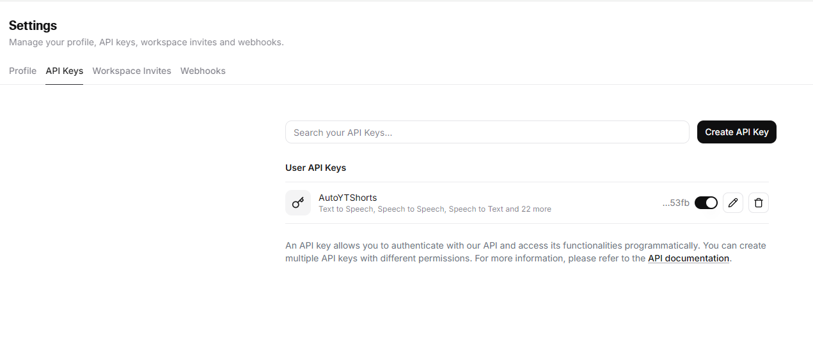
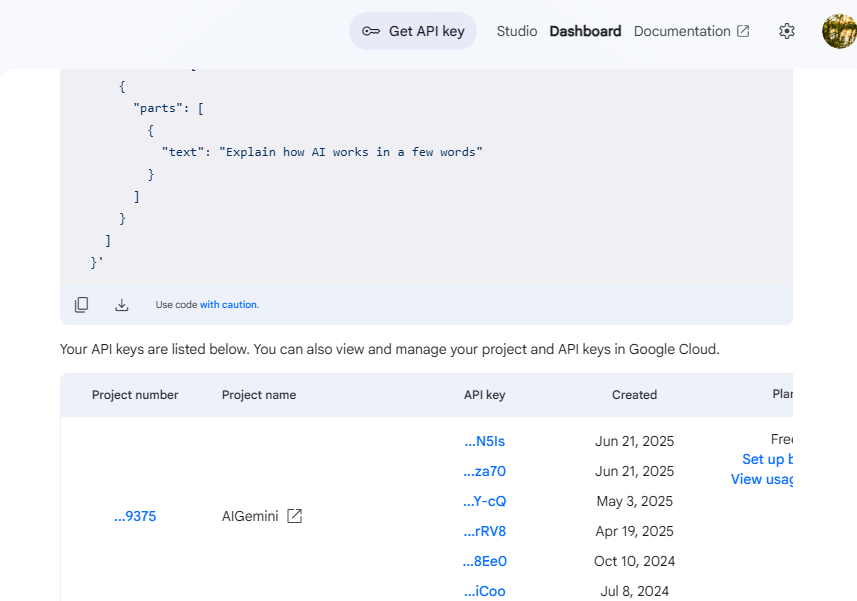

# ℹ️ About
A **COOL** TOOL to make `YouTube Shorts` by harnessing the power of

# 📈 Repo Stats
### 🌟 Stars

### 🍴 Forks

# 🎁 Donations

### 💖 Don't donate, just sub!

- 🎥 Support me by subscribing to my channel:  
    
    

- **💪 Every view, like, and sub helps me keep building cool stuff! 🧪**
    
    

# 👀 Future Ideas
- ### 🚀 Making this a cool library.

# 🖼️ Gallery

# 📃 Docs
Can be found at [here](https://github.com/pro-
grammer-SD/Auto-YT-Shorts/wiki/)
